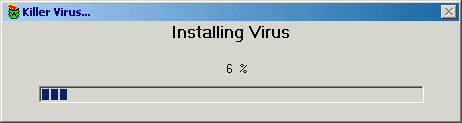



## Fake Viri \(Update\)

### Description

This is an update to my not so liked Fake viri.

This version fixes what all the complainers out there, were complaining about... disables control alt delete(not in win2k), hides the taskbar, and desktop icons.

this time it restarts a computers, this means it no longer limited to only win98. it has been tested on win98, and win2k. (control alt delete still works in win2k) windows me is still untested. Again the only way out is the % sign.

now, hopefully, this will stop all the complainers out there, and it's people that, that really bring this planet down...
 
### More Info
 

             |
---                |---
**Submitted On**   |2000-10-31 07:08:58
**By**             |[atwinda](https://github.com/Planet-Source-Code/PSCIndex/blob/master/ByAuthor/atwinda.md)
**Level**          |Intermediate
**User Rating**    |2.6 (18 globes from 7 users)
**Compatibility**  |VB 5\.0, VB 6\.0
**Category**       |[Jokes/ Humor](https://github.com/Planet-Source-Code/PSCIndex/blob/master/ByCategory/jokes-humor__1-40.md)
**World**          |[Visual Basic](https://github.com/Planet-Source-Code/PSCIndex/blob/master/ByWorld/visual-basic.md)
**Archive File**   |[CODE\_UPLOAD1117010312000\.zip](https://github.com/Planet-Source-Code/atwinda-fake-viri-update__1-12440/archive/master.zip)

